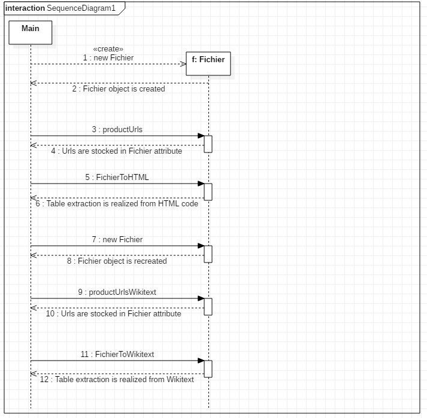
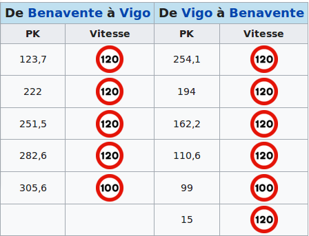
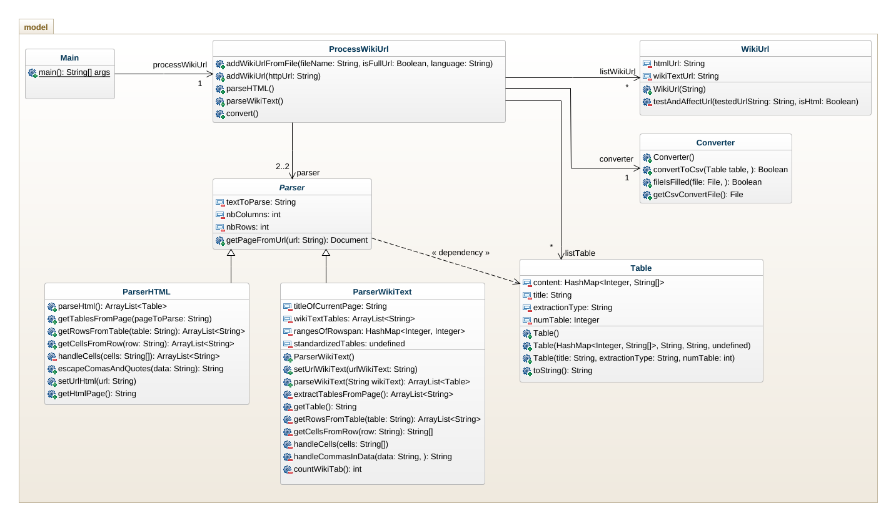
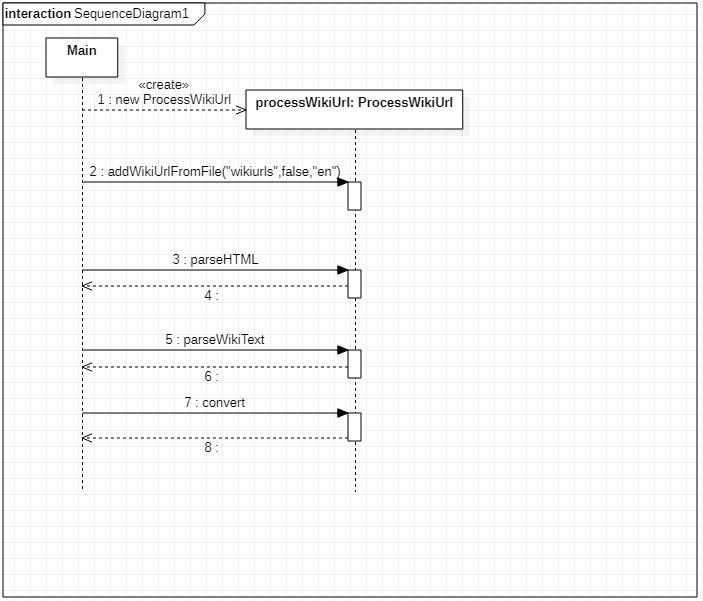

# First Version 

## Global architecture

This project contains two packages : "model" which contains all classes and "test" which contains all test classes.

The global architecture is : 

We spotted some issues like “useless” inheritances. On the diagram, we can see “Fichier” extends “Url” which extends “FormatHTML”, but those extends are not used in code ("Fichier" do not use "Url" methods, nor did "Url" use "FormatHTML" methods) and did not follow any software logic. Moreover, if we removed the inheritance, the program was running with no difference, hence the "useless" term. 

Some operations do not follow traditional coding conventions:
* Some methods name start with a capital letter (that is a recurrent problem)
* Project's class "Url" could be confused with Java'a class "Url", the name need to be changed
* French and english are mixed in the project, it need to be normalized
* Some attributes name can be confusing (i.e : urlUrl from the Url class...), attributes names need to be explicit
* There are some unused methods or attributes

Even if not causing technical difficulties, these coding conventions issues can cause misunderstanding for future developers and should be corrected using code refactoring with the IDE.

## Class descriptions

| Class | Extends | Description | 
| --- | --- | --- |
| Fichier | Url, FormatHTML, Thread (Java class) | Produces the different Wikipedia pages urls, triggers the HTML and Wikitext extraction |
| FormatHTML | Thread (Java class) | Extracts the HTML tables form the Wikipedia pages and calls the CSV conversion methods |
| FormatWikiText |  | Extracts the wikitext tables form the Wikipedia pages and calls the CSV conversion methods |
| Main |  | Runs the program creates "Fichier" Objects |
| ProductionCSV |  | Deals with the conversion of HTML and Wikitext tables into CSV |
| Url | FormatHTML, Thread (Java class) | Contains methods which test if the urls are valid |

  
## Dynamic model
  
Actually, the project starts when Main class is executed. This class allows to start a Wikipedia table extraction from two different formats : HTML or Wikitext. 

The nominal scenario represents a Main execution without errors :
 

In the main, a Fichier object is created. This object contains a Set<Url> attribute, called "setUrl" grouping all Wikipedia urls. This object will permit to do operations on Wikipedia page.

First, productUrls() is called and fills "setUrl". For that, this method reads ‘wikiurls.txt’ which contains all Wikipedia pages that we want to treat. Each page is added to the Set respecting this format:  https://en.wikipedia.org/wiki/ + page name.

Then "FichierToHTML()" is executed and realizes Wikipedia table extraction. The extraction consits to create a CSV file for each table in a page. It will contain the HTML extraction from Wikipedia table contents. This file is present in ‘output/html’.

To realize the table extraction form Wikitext, a "Fichier" object is recreated to reinitialize "setUrl" attribute.

After that, "productUrlsWikitext()" is called. This method has the same role that "productUrls()" but stores urls in antoher format : https://en.wikipedia.org/w/index.php?title= + page name + &action=edit.

At the end, "FichierToWikitext()" is executed. This method creates a CSV file for each table in a page. This file contains the HTML extraction from Wikipedia table content and is present in "output/html".

## Execution scenarios

The rated scenario consists to realize the extraction of all tables contained in the Wikipedia pages defined in "wikiurls.txt" in two different formats: HTML or Wikitext and to convert each extracted table into a CSV file. A successful extraction and conversion is, for all pages, a CSV file correctly established : the first line has to contain the column names and the other lines the date. Moreover the number of columns should be equal between the different lines and the data should not be altered.

An alternative run scenario is an execution whose scenario is not very common. An example is a table which contains pictures. The extraction of the cell will be different for a picture. Indeed, the HTML or wiki text tags surrounding the picture are different from those used for a simple text. Nevertheless, this scenario should lead to the creation of a proper CSV file.

An example of an exceptional scenario is the extraction of a Wikipedia page where the number of rows or columns is not the same within a same table (see below). This will throw an exception that must be handled in order to not stop the program abruptly. In conclusion, no CSV file will be formed from this table.

## Tests Results

Tests results realised on 10/08/19

| <h3>Test name</h3>        |  <h3>Final Result </h3>  |
|:------:|-----|
| **TestCSV**  | Empty |
| **TestFichier**  	|||
|  
TestRemove2 
	| OK |
|  TestUrlFromFile  	| OK |
|  TestAdd2  	| OK |
|  TestToString  	| OK |
|  TestRemove  	| OK |
|  TestReadFile  	| Failed => Assertion Error : <ul><li>Expected : 312</li> <li>Actual : 314</li></ul>	|
|  TestAdd  	| OK |
| **TestHTML**  	| |
|  Testhtml  	| Error => Array Index Out Of Bounds Exception : Index 1 out of bounds for lenght 1 	|
|  TestTitle  	| Failed => Comparison failure 	|
|  TestNbColonnes  	| Failed => Assertion Error : <ul><li>Expected : 1</li> <li>Actual : 10</li></ul> 	|
| **TestPDL**	| |
|  TestWiki	| Error  => null pointer exception	|
| **TestURL**	| |
|  TestToHTML  	| OK	|
|  TestValideUrl  	|  TestValideUrl  	| Failed => AssertionError 	|
|  TestNonValidUrl  	| OK |
|  TestRedirectUrl  	| Failed => Assertion Error : lien redirigé	|
| **TestWikiText**  	| |
|  TestNbLignes  	| Failed => Assertion Error : <ul><li>Expected : 0</li> <li>Actual : 9</li></ul> |
|  TestNewUrl  	| OK |
|  TestNbTableau  	| OK |

# Improvements proposals

## Global architecture

Note : some methods (like getters and setters) were omited for readability.

| Class | Extends | Description | 
| --- | --- | --- |
| Main | | Runs the program by creating an instance of ProcessWikiUrl |
| ProcessWikiUrl | | Produces the different Wikipedia urls from txt files and instantiate a List of objects WikiUrl. Then it triggers the HTML and Wiki Text extraction by calling Parser’s methods. |
| WikiUrl |  | Contains 2 attributes : one to store the http url and the other one for the Wiki Text url |
| Parser |  | SuperClass which factorizes some common attributes between ParserHTML and ParserWikiText |
| ParserHTML | Parser | Specialization of Parser. Contains specifics methods to parse HTML |
| ParserWikiText | Parser | Specialization of Parser. Contains specifics methods to parse Wiki Text |
| Table |  | The "content" attribute of this class represents the contents of an array. This map contains a key (the line’s number) and a value (an array of String containing the text of each cell) |
| Converter |  | Convert the Table obtained by the Parser into  a CSV file |

In this proposal, we will remove the inefficient inheritances mentioned above and also give a more specific role to each class. We will enforce the respect of coding conventions and expand test methods.

This proposal is likely to be changed during development.

## Dynamic model

In this new version, the Main class does the same thing : extract tables from urls with two ways : html and wikitext.

However, in this version the scenario has changed : 

In the main a ProcessWikiUrl object is created. This object contains : 
* a list of WikiUrl
* a list of Table
* a ParserHTML object
* a ParserWikiText object
* a Converter converter

First, "addWikiUrlFromFile ()" is called. This function reads "wikiurls.txt" and fills WikiUrl list.
Then, "parseHTML ()" is executed and realizes the HTML extraction. When a Wikipedia table is extracted, a Table object is created, filled with the Wikipedia table content and add to the Table list.
After, "parseWikiText ()" is executed and realizes the WikiText extraction. When a Wikipedia table is extracted, a Table object is created, filled with the Wikipedia table content and add to the Table list. This object is a common structure which takes the results of our two parsers. This is vey practical in order to compare their results.
Finally, "convert ()" is called. This methods consits in writing all Table in the list in a csv file.

## Special cases

CSV is a very basic format. It does not have any conventions for pictures or links. More problematic, there is no easy way to write table rowspan and colspan in CSV. An easy way would be to ignore rows containing rowspans or colspans but this will delete a large amount of data. The solution we chose is to replace colspan and rowspan with empty cells.
The goal of this solution is to retrieve a valid CSV (the same number of cells per row) while keeping the maximum of the original data.

For links, we decided to keep their title only as we prefer to keep comprehensive data. For pictures, we decided to keep their links as it will help the user to find them back on the internet.

## Tests results

| Test name | Final Result |
|:------:|-----|
| **BenchTest**	| |
| testBenchExtractors | OK |
| **TestWikiUrl**	| |
| testChineseUrl	| OK	|
| testValidUrl	| OK|
| testInvalidUrl	| OK	|
| testNullUrl	| OK	|
| testEmptyUrl | OK |
| **TestParserComparaison**	| |
| testCompareNbTabHTML | Failed => Assertion Error : <ul><li>Expected : 100 </li> <li>Actual : 80 |
| testCompareNbTabWikiText |Failed => Assertion Error : <ul><li>Expected : 100 </li> <li>Actual : 59 </li></ul> |
| **TestParserHTML**	| |
| testParseHtml | OK |
| testParseHtmlTree | OK |
| testGetTablesFromPage2 | OK |
| testGetTablesFromPage3 | OK |
| testEscapeComasAndQuotes | OK |
| testGetRowsFromTable | OK |
| testGetCellsFromRow | OK |
| testEscapeComasAndQuotes | OK |
| **TestParserWikiText**	| |
| testParseWikiTextNoTab | OK |
| testParseWikiTextNotWikitable | OK |
| testParseWikiText1Tab | OK |
| testParseWikiText8Tab | OK |
| testParseWikiTextNbLign1 | OK |
| testParseWikiTextNbLign2| OK |
| testParseWikiTextNbLign3 | OK |
| testParseWikiTextNbLign4 | OK |
| testParseWikiTextNbLign5 | OK |
| testParseWikiTextNbLign6 | OK |
| testParseWikiTextNbCell1 | OK |
| testParseWikiTextNbCell2 | OK |
| testParseWikiTextNbCell3 | OK |
| testParseWikiTextNbCell4 | OK |
| testParseWikiTextNbCell5 | OK |
| testParseWikiTextNbCell6 | OK |
| **TestProcessWikiUrl**	| |
| testAddWikiUrlFromFileValid | OK |
| testAddWikiUrlFromFileInvalid | OK |
| testAddWikiUrl | OK|
| testAddWikiUrlInvalid | OK |
| testParseHTML | OK |
| testParseWikiText | OK |
| **TestConverter**	| |
| testFileIsCreated | OK  |
| testCheckNbRows| OK  |
| testCheckNbColumn| Failed => Assertion Error : <ul><li>Expected : 2726 </li> <li>Actual : 2614 </li></ul>  |
| testCsvValid | Failed => Assertion Error : <ul><li>Expected : 2726 </li> <li>Actual : 1862 </li></ul>|
| **TestCSVTemoin**	| |
| testTemoin | OK |
  

